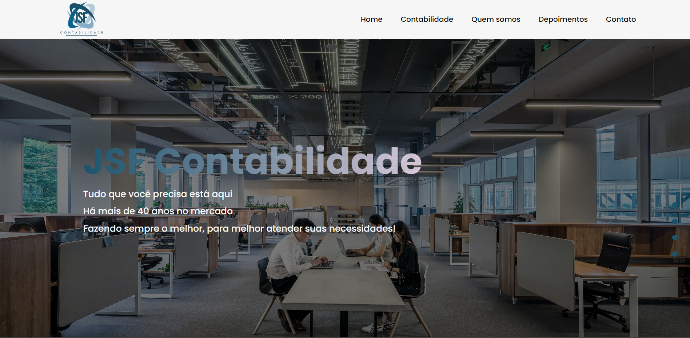

<h1 align="center"> JSF Contabilidade</h1>

## 💻 Projeto
Landing page desenvolvida para atender a JSF Contabilidade

Para acessar o projeto [Clique Aqui!](https://jsfhugo.netlify.app/#contact)

    
    
     
  

## 🚀 Tecnologias Utilizadas
Esse projeto foi desenvolvido com as seguintes tecnologias: 
HTML  
CSS  
Tailwindcss 
JavaScript 
ReactJs 
React Router Dom 
React Icons 
React Anchor Link Smooth Scroll
Emailjs 
Framer Motion

                                              
